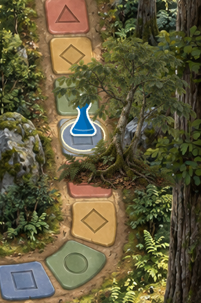
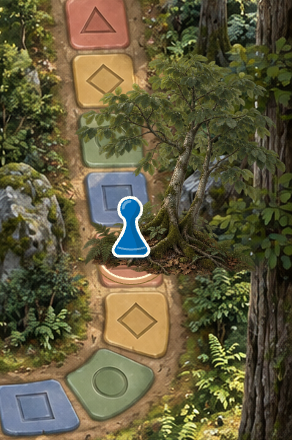

# Bos: langs de boom bij vak 31–36

Lokale correctie, 13 september 2026. Niet gepubliceerd.

De boomlaag bedekte de pion ook wanneer het pad bij vak 34 vóór de wortels langs loopt. Daarnaast verwees het voorbeeld ‘Langs de boom’ nog naar vak 1–3.

De bestaande boom behoudt positie en afbeelding. In `Kaarten/ruimtewerking.js` heeft deze boom een eigen dieptedrempel op y=527, tussen vak 33 (y=497) en vak 34 (y=557). De schermpositie wordt teruggerekend naar de oorspronkelijke kaartcoördinaten. Daardoor werkt dezelfde overgang tijdens bewegen, stilstaan, teruglopen en op verschillende schermformaten. Vak 31–33 behoudt de achterlaag, vak 34–35 krijgt de voorlaag; voorbij de boom bij 36 is geen overlap meer. De tunnelregels blijven voorgaan tijdens tunnelbewegingen.

Het voorbeeld in `Kaarten/bos-bosroute.js` volgt nu vak 31–36.

## Controle

`tests/forest-tree.cjs` is geslaagd: stationaire pionnen op vak 31–36 bij 788 en 1672 px vensterbreedte; een echte worp van 30 naar 36; bemonstering van de diepte tijdens lopen; het voorbeeld vooruit en achteruit; dezelfde opgeslagen spelstand na beide voorbeelden; geen browserfouten.

De close-ups van vak 33 en 34 zijn visueel gecontroleerd. De bestaande les in de lokale preview is behouden.

Volledige `npm test`: geslaagd, alle 23 onderdelen. Dit omvat alle elf kaartwerelden, tunnelmonden, labels, voorgrondlagen, voorbeeldbewegingen, annuleren, opslag, spelvormen, toetsenbord en geluid.

## Aanvulling: oude browserkopie

Na de eerste correctie bleek de open in-app browser nog de oude `pawnDepth`-functie en het voorbeeld 1→3 te gebruiken, terwijl de lokale server de nieuwe bestanden leverde. Dat is rechtstreeks in de draaiende app vastgesteld. De HTML laadt de dieptecode en de app-loader nu met een expliciete bestandsversie; dynamische kaartmodules nemen de versie van de loader over. De actieve app is zonder oude cache herladen.

In de echte in-app browser is vervolgens bevestigd: nieuwe dieptecode actief, voorbeeld 31→36, bewaarde pion op vak 34 op laag 11 vóór de boom op laag 10. Visueel gecontroleerd en door de gebruiker bevestigd: ‘Ja, nu is het goed. Perfect.’

Gerichte aanvullende controles geslaagd: `tests/map-cache.cjs` (oude scripts met een jaar browsercache, daarna nieuwe HTML: alle drie scripts worden vernieuwd; les, instellingen, deelnemers en geschiedenis behouden), `tests/forest-tree.cjs` en `tests/integration.cjs`. De eerdere volledige testreeks hoort bij de dieptecorrectie; voor deze aanvullende laadwijziging zijn de genoemde gerichte controles uitgevoerd.
